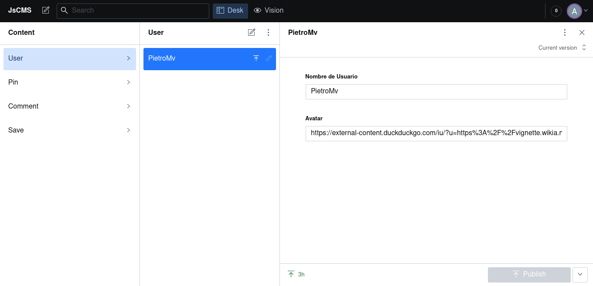

# JsCms

This solution is meant to be a lighter substitute for wordpress.

Being a javascript solution it is better alternative in terms of scalability with containerization tecnology such as [Kubernetes].(https://kubernetes.io/es/)

## Table of contents

- [Overview](#overview)
  - [The challenge](#the-challenge)
  - [Screenshot](#screenshot)
  <!-- - [Links](#links) -->
- [My process](#my-process)
  - [Built with ReactJs](#built-with-reactjs)
  <!-- - [What I learned](#what-i-learned)
  - [Continued development](#continued-development)
  - [Useful resources](#useful-resources) -->
    <!-- - [Author](#author) -->
    <!-- - [Acknowledgments](#acknowledgments) -->

## Overview

### The Challenge

Users should be able to:

- View the optimal layout depending on their device's screen size (Web Responsive page)
- Content managment System

## Screenshots

### Built with ReactJs

- Mobile-first workflow
- Semantic HTML5 markup
- CSS custom properties
- Flexbox & Grid
- [React](https://reactjs.org/) - JS library
<!--
- [Next.js](https://nextjs.org/) - React framework
- [Styled Components](https://styled-components.com/) - For styles -->

<!--## Author

 - Website - [Add your name here](https://www.your-site.com) -->
